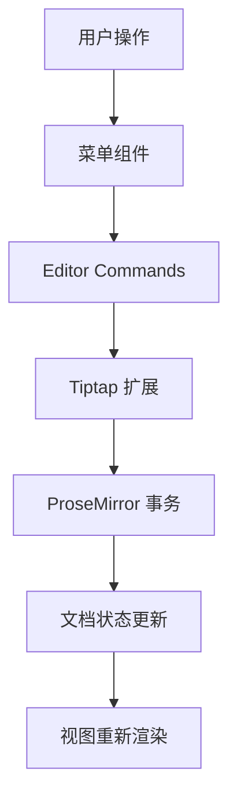
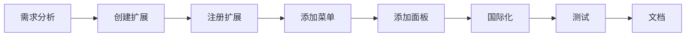

# Umo Editor 开发指南

> **版本**: v8.1.0
> **最后更新**: 2025-11-26

## 📋 目录

- [快速开始](#快速开始)
- [开发环境配置](#开发环境配置)
- [项目架构](#项目架构)
- [核心概念](#核心概念)
- [开发工作流](#开发工作流)
- [扩展开发](#扩展开发)
- [组件开发](#组件开发)
- [国际化](#国际化)
- [测试](#测试)
- [代码规范](#代码规范)
- [常见问题](#常见问题)

---

## 快速开始

### 安装依赖

```bash
# 推荐使用 pnpm
pnpm install

# 或使用 npm
npm install

# 或使用 yarn
yarn install
```

### 启动开发服务器

```bash
npm run dev
```

访问 `http://localhost:9000` 查看编辑器。

### 构建生产版本

```bash
npm run build
```

构建产物将输出到 `dist/` 目录。

---

## 开发环境配置

### 必需软件

- **Node.js**: >= 18.0.0
- **pnpm**: >= 8.0.0（推荐）
- **Git**: 版本控制

### 推荐工具

- **VS Code**: 代码编辑器
- **Vue Language Features (Volar)**: Vue 3 支持
- **TypeScript Vue Plugin (Volar)**: TypeScript 支持
- **ESLint**: 代码检查
- **Prettier**: 代码格式化

### VS Code 配置

项目已包含 `.vscode/` 配置：

```json
{
  "editor.formatOnSave": true,
  "editor.defaultFormatter": "esbenp.prettier-vscode",
  "editor.codeActionsOnSave": {
    "source.fixAll.eslint": true
  }
}
```

---

## 项目架构

### 技术选型

#### 核心技术栈

```
Vue 3 (Composition API) + TypeScript
    ↓
Tiptap (ProseMirror)
    ↓
TDesign Vue Next (UI 组件)
    ↓
Vite (构建工具)
```

#### 架构图

```
┌─────────────────────────────────────────┐
│          Umo Editor 组件层               │
│  ┌──────────┐  ┌──────────┐  ┌────────┐│
│  │ 工具栏   │  │ 编辑器   │  │ 面板   ││
│  └──────────┘  └──────────┘  └────────┘│
└─────────────────────────────────────────┘
                  ↓
┌─────────────────────────────────────────┐
│           Tiptap 扩展层                  │
│  ┌──────┐ ┌──────┐ ┌──────┐ ┌────────┐│
│  │图片  │ │表格  │ │批注  │ │更多... ││
│  └──────┘ └──────┘ └──────┘ └────────┘│
└─────────────────────────────────────────┘
                  ↓
┌─────────────────────────────────────────┐
│         ProseMirror 核心层               │
│  文档模型 | 状态管理 | 转换 | 视图      │
└─────────────────────────────────────────┘
```

### 数据流



---

## 核心概念

### 1. Tiptap 编辑器

Tiptap 是基于 ProseMirror 的无头编辑器框架。

#### 核心概念

- **Document**: 文档内容（JSON 结构）
- **Schema**: 文档结构定义
- **State**: 编辑器状态
- **Transaction**: 状态变更
- **Extension**: 功能扩展
- **Mark**: 标记（行内样式）
- **Node**: 节点（块级元素）

#### 编辑器实例获取

```typescript
// 在组件中
const editor = inject('editor')

// 编辑器操作
editor.value?.chain().focus().toggleBold().run()
editor.value?.commands.setComment('comment-id')
```

### 2. 扩展系统

#### 扩展类型

1. **Mark 扩展**（行内标记）
   - 示例：粗体、斜体、批注⭐、高亮
   - 特点：可以重叠

2. **Node 扩展**（节点）
   - 示例：段落、标题、图片、表格
   - 特点：不可重叠

3. **Extension 扩展**（功能）
   - 示例：快捷键、拖拽、历史记录
   - 特点：全局功能

#### 扩展结构

```typescript
import { Mark } from '@tiptap/core'

export default Mark.create({
  name: 'myExtension',           // 扩展名称
  priority: 1000,                 // 优先级

  addOptions() {
    return {
      // 默认选项
    }
  },

  addAttributes() {
    return {
      // 节点/标记属性
    }
  },

  addCommands() {
    return {
      // 命令定义
    }
  },

  addKeyboardShortcuts() {
    return {
      // 快捷键
    }
  },

  addProseMirrorPlugins() {
    return [
      // ProseMirror 插件
    ]
  },

  parseHTML() {
    return [
      // HTML 解析规则
    ]
  },

  renderHTML({ HTMLAttributes }) {
    // HTML 渲染
  },
})
```

### 3. 组合式 API (Composables)

#### 状态管理模式

```typescript
// src/composables/comment.ts
export function useComment(editor, currentUser) {
  // 响应式状态
  const comments = ref(new Map())
  const activeCommentId = ref(null)

  // 方法
  const addComment = (content, commentId) => { }
  const deleteComment = (commentId) => { }

  // 计算属性
  const commentCount = computed(() => comments.value.size)

  // 返回 API
  return {
    comments,
    activeCommentId,
    addComment,
    deleteComment,
    commentCount,
  }
}
```

#### 使用方式

```vue
<script setup>
const editor = inject('editor')
const commentState = useComment(editor, currentUser)
</script>
```

### 4. 配置系统

#### 选项验证

使用 `@eslint/object-schema` 进行配置验证：

```typescript
// src/options/index.ts
const ojbectSchema = new ObjectSchema({
  comment: {
    merge: 'replace',
    validate: 'object',
    required: false,
    schema: {
      enabled: {
        validate: 'boolean',
        required: false,
      },
      currentUser: {
        validate: 'object',
        required: false,
      },
    },
  },
})
```

---

## 开发工作流

### 1. 功能开发流程



### 2. 开发步骤示例（以批注功能为例）⭐

#### Step 1: 创建扩展

```typescript
// src/extensions/comment.ts
import { Mark } from '@tiptap/core'

export default Mark.create<CommentOptions>({
  name: 'comment',

  addAttributes() {
    return {
      commentId: {
        default: null,
        parseHTML: element => element.getAttribute('data-comment-id'),
        renderHTML: attributes => ({
          'data-comment-id': attributes.commentId,
        }),
      },
    }
  },

  addCommands() {
    return {
      setComment: (commentId) => ({ commands }) => {
        return commands.setMark(this.name, { commentId })
      },

      unsetComment: (commentId) => ({ commands }) => {
        return commands.unsetMark(this.name)
      },
    }
  },

  parseHTML() {
    return [
      {
        tag: 'span[data-comment-id]',
      },
    ]
  },

  renderHTML({ HTMLAttributes }) {
    return ['span', HTMLAttributes, 0]
  },
})
```

#### Step 2: 注册扩展

```typescript
// src/extensions/index.ts
import Comment from './comment'

extensions.push(Comment)
```

#### Step 3: 添加配置

```typescript
// src/options/index.ts
const defaultOptions = {
  comment: {
    enabled: true,
    currentUser: {
      id: 'default-user',
      name: '默认用户',
    },
  },
}

// 添加验证规则
const ojbectSchema = new ObjectSchema({
  comment: {
    merge: 'replace',
    validate: 'object',
    required: false,
  },
})
```

#### Step 4: 创建组合式 API

```typescript
// src/composables/comment.ts
export function useComment(editor, currentUser) {
  const comments = ref(new Map())

  const addComment = (content, commentId) => {
    const comment = {
      id: commentId,
      content,
      author: currentUser,
      createdAt: Date.now(),
    }
    comments.value.set(commentId, comment)
  }

  return {
    comments,
    addComment,
  }
}
```

#### Step 5: 添加工具栏按钮

```vue
<!-- src/components/menus/toolbar/page/toggle-comment.vue -->
<template>
  <menus-button
    ico="comment"
    :text="t('comment.title')"
    :disabled="!hasSelection"
    @menu-click="handleClick"
  />
  <comment-dialog
    :visible="dialogVisible"
    @confirm="handleAddComment"
  />
</template>

<script setup>
const editor = inject('editor')
const hasSelection = computed(() => {
  const { from, to } = editor.value.state.selection
  return from !== to
})
</script>
```

#### Step 6: 添加气泡菜单按钮

```vue
<!-- src/components/menus/bubble/comment.vue -->
<template>
  <menus-button
    ico="comment"
    :text="t('comment.add')"
    @menu-click="handleClick"
  />
</template>
```

#### Step 7: 添加面板组件

```vue
<!-- src/components/container/comment.vue -->
<template>
  <div class="umo-comment-container">
    <div class="umo-comment-header">
      {{ t('comment.title') }}
    </div>
    <div class="umo-comment-content">
      <!-- 批注列表 -->
    </div>
  </div>
</template>
```

#### Step 8: 国际化

```json
// src/locales/zh-CN.json
{
  "comment": {
    "title": "批注",
    "add": "添加批注",
    "edit": "编辑批注",
    "delete": "删除批注"
  }
}
```

```json
// src/locales/en-US.json
{
  "comment": {
    "title": "Comment",
    "add": "Add Comment",
    "edit": "Edit Comment",
    "delete": "Delete Comment"
  }
}
```

#### Step 9: 添加样式

```less
// src/assets/styles/comment.less
.umo-comment {
  background-color: rgba(255, 221, 0, 0.2);
  border-bottom: 2px solid #ffdd00;
  cursor: pointer;

  &:hover {
    background-color: rgba(255, 221, 0, 0.3);
  }
}

[data-theme='dark'] {
  .umo-comment {
    background-color: rgba(255, 221, 0, 0.1);
    border-bottom-color: #cca700;
  }
}
```

#### Step 10: 编写测试

```typescript
// tests/comment.spec.ts
import { describe, it, expect } from 'vitest'
import { mount } from '@vue/test-utils'

describe('Comment Extension', () => {
  it('should add comment mark', () => {
    // 测试代码
  })
})
```

#### Step 11: 编写文档

```markdown
# 批注功能文档

## 使用方式
...

## API
...
```

### 3. 调试技巧

#### 编辑器状态调试

```typescript
// 在浏览器控制台
window.__editor = editor.value

// 查看文档内容
console.log(__editor.getJSON())

// 查看选区
console.log(__editor.state.selection)

// 查看所有扩展
console.log(__editor.extensionManager.extensions)
```

#### Vue DevTools

- 安装 Vue DevTools 浏览器扩展
- 查看组件树
- 检查响应式数据
- 追踪事件

---

## 扩展开发

### Mark 扩展开发（批注示例）⭐

#### 1. 定义 Mark

```typescript
export default Mark.create<CommentOptions>({
  name: 'comment',
  priority: 1000, // 优先级（数字越大优先级越高）

  addOptions() {
    return {
      class: 'umo-comment',
      commentId: null,
    }
  },

  addAttributes() {
    return {
      commentId: {
        default: null,
        parseHTML: element => element.getAttribute('data-comment-id'),
        renderHTML: attributes => {
          if (!attributes.commentId) return {}
          return {
            'data-comment-id': attributes.commentId,
            class: this.options.class,
          }
        },
      },
    }
  },

  addCommands() {
    return {
      setComment: (commentId) => ({ commands }) => {
        return commands.setMark(this.name, { commentId })
      },

      unsetComment: (commentId) => ({ commands, tr, state }) => {
        // 移除特定批注
        const { doc } = state
        doc.descendants((node, pos) => {
          if (node.marks.find(mark =>
            mark.type.name === this.name &&
            mark.attrs.commentId === commentId
          )) {
            tr.removeMark(pos, pos + node.nodeSize, this.type)
          }
        })
        return true
      },
    }
  },

  parseHTML() {
    return [
      {
        tag: `span[data-comment-id]`,
        getAttrs: element => ({
          commentId: element.getAttribute('data-comment-id'),
        }),
      },
    ]
  },

  renderHTML({ HTMLAttributes }) {
    return ['span', mergeAttributes(HTMLAttributes, {
      class: this.options.class,
    }), 0]
  },
})
```

#### 2. 类型定义

```typescript
// types/index.d.ts
export interface CommentOptions {
  class: string
  commentId: string | null
  onCommentClick?: (commentId: string) => void
}

export interface CommentAuthor {
  id: string
  name: string
  avatar?: string
}

export interface Comment {
  id: string
  content: string
  author: CommentAuthor
  createdAt: number
  resolved: boolean
  replies: CommentReply[]
}

// 扩展命令类型
declare module '@tiptap/core' {
  interface Commands<ReturnType> {
    comment: {
      setComment: (commentId: string) => ReturnType
      unsetComment: (commentId?: string) => ReturnType
      getAllComments: () => ReturnType
    }
  }
}
```

### Node 扩展开发

```typescript
import { Node } from '@tiptap/core'

export default Node.create({
  name: 'customBlock',

  group: 'block',
  content: 'block+',

  addAttributes() {
    return {
      type: {
        default: 'info',
      },
    }
  },

  parseHTML() {
    return [
      { tag: 'div[data-custom-block]' },
    ]
  },

  renderHTML({ HTMLAttributes }) {
    return ['div', mergeAttributes(HTMLAttributes, {
      'data-custom-block': '',
    }), 0]
  },
})
```

---

## 组件开发

### Vue 组件规范

#### 组件结构

```vue
<template>
  <!-- 模板 -->
</template>

<script setup lang="ts">
// 导入
import { ref, computed, inject } from 'vue'

// Props & Emits
const props = defineProps<{
  visible: boolean
}>()

const emit = defineEmits<{
  close: []
}>()

// 依赖注入
const editor = inject('editor')
const options = inject('options')

// 响应式数据
const loading = ref(false)

// 计算属性
const isReady = computed(() => !loading.value)

// 方法
const handleClick = () => {
  // ...
}
</script>

<style lang="less" scoped>
// 样式（使用 BEM 命名规范）
.umo-component {
  &__element {
    // ...
  }

  &--modifier {
    // ...
  }
}

// 暗色主题
[data-theme='dark'] {
  .umo-component {
    // ...
  }
}
</style>
```

#### 命名规范

- **组件文件**: kebab-case（如 `toggle-comment.vue`）
- **组件名**: PascalCase（如 `ToggleComment`）
- **CSS 类**: BEM 命名（如 `umo-comment__header`）

#### BEM 命名示例

```less
// Block
.umo-comment {
  // Element
  &__header { }
  &__content { }
  &__footer { }

  // Modifier
  &--active { }
  &--disabled { }
}
```

### 依赖注入

#### 提供的全局注入

```typescript
// 可以通过 inject 获取
const editor = inject('editor')          // 编辑器实例
const options = inject('options')        // 配置选项
const container = inject('container')    // 容器组件
const commentPanel = inject('commentPanel') // 批注面板状态
const assistant = inject('assistant')    // AI 助手状态
```

---

## 国际化

### 添加翻译

#### 1. 中文翻译

```json
// src/locales/zh-CN.json
{
  "comment": {
    "title": "批注",
    "add": "添加批注",
    "edit": "编辑批注",
    "delete": "删除批注",
    "reply": "回复",
    "resolve": "解决",
    "reopen": "重新打开",
    "defaultUser": "默认用户"
  }
}
```

#### 2. 英文翻译

```json
// src/locales/en-US.json
{
  "comment": {
    "title": "Comment",
    "add": "Add Comment",
    "edit": "Edit Comment",
    "delete": "Delete Comment",
    "reply": "Reply",
    "resolve": "Resolve",
    "reopen": "Reopen",
    "defaultUser": "Default User"
  }
}
```

### 使用翻译

#### 在组件中

```vue
<template>
  <div>{{ t('comment.title') }}</div>
</template>

<script setup>
// t 函数已自动导入（unplugin-auto-import）
</script>
```

#### 带参数的翻译

```json
{
  "comment": {
    "count": "{count} 条批注"
  }
}
```

```typescript
t('comment.count', { count: 5 }) // "5 条批注"
```

---

## 测试

### 单元测试

使用 Vitest 进行单元测试：

```typescript
// tests/comment.spec.ts
import { describe, it, expect, beforeEach } from 'vitest'
import { mount } from '@testing-library/vue'
import { Editor } from '@tiptap/core'
import Comment from '@/extensions/comment'

describe('Comment Extension', () => {
  let editor

  beforeEach(() => {
    editor = new Editor({
      extensions: [Comment],
      content: '<p>Test content</p>',
    })
  })

  it('should create comment mark', () => {
    editor
      .chain()
      .focus()
      .selectAll()
      .setComment('comment-1')
      .run()

    const html = editor.getHTML()
    expect(html).toContain('data-comment-id="comment-1"')
  })

  it('should remove comment mark', () => {
    editor
      .chain()
      .focus()
      .selectAll()
      .setComment('comment-1')
      .unsetComment('comment-1')
      .run()

    const html = editor.getHTML()
    expect(html).not.toContain('data-comment-id')
  })
})
```

### 运行测试

```bash
# 运行所有测试
npm run test

# 监听模式
npm run test:watch

# 生成覆盖率报告
npm run test:coverage
```

---

## 代码规范

### ESLint 规则

#### 自动修复

```bash
npm run lint:code
```

#### 主要规则

- **无未使用的变量**
- **导入自动排序**
- **Vue 组件命名规范**
- **TypeScript 严格模式**

### Prettier 格式化

```bash
npm run format
```

#### 配置

```json
{
  "semi": false,
  "singleQuote": true,
  "tabWidth": 2,
  "trailingComma": "all"
}
```

### Git Hooks

使用 Husky + lint-staged 在提交前自动检查：

```json
{
  "lint-staged": {
    "*.{js,ts,vue}": ["eslint --fix"],
    "*.{css,less,vue}": ["stylelint --fix"],
    "*.{js,ts,vue,css,less,json,md}": ["prettier --write"]
  }
}
```

### 提交规范

推荐使用 [Conventional Commits](https://www.conventionalcommits.org/):

```bash
feat: 添加批注功能
fix: 修复批注删除bug
docs: 更新批注文档
style: 优化批注样式
refactor: 重构批注代码
test: 添加批注测试
chore: 更新依赖
```

---

## 常见问题

### 1. 编辑器实例未定义

**问题**: `Cannot read property 'chain' of undefined`

**解决**:
```typescript
const editor = inject('editor')

// ❌ 错误
editor.chain().focus().run()

// ✅ 正确
editor.value?.chain().focus().run()
```

### 2. 扩展未生效

**检查清单**:
- ✅ 扩展已在 `src/extensions/index.ts` 中注册
- ✅ 扩展名称唯一
- ✅ 优先级设置正确
- ✅ 清除浏览器缓存并重新构建

### 3. 样式不生效

**解决**:
```less
// ✅ 正确：使用 BEM 命名
.umo-comment {
  &__header { }
}

// ✅ 确保导入样式
// src/assets/styles/index.less
@import './comment.less';
```

### 4. 类型错误

**问题**: `Property does not exist on type`

**解决**:
```typescript
// 1. 添加类型定义
// types/index.d.ts
export interface Comment {
  id: string
  content: string
}

// 2. 运行类型检查
npm run check:types
```

### 5. 热更新不工作

**解决**:
```bash
# 清除缓存并重启
rm -rf node_modules/.vite
npm run dev
```

### 6. 构建失败

**常见原因**:
- TypeScript 类型错误
- ESLint 错误
- 缺少依赖

**解决**:
```bash
# 检查类型
npm run check:types

# 检查代码
npm run check:code

# 修复代码
npm run lint:code
```

---

## 最佳实践

### 1. 组件开发

- ✅ 使用 `<script setup>` 语法
- ✅ 使用 TypeScript
- ✅ 合理拆分组件
- ✅ 使用 Composition API
- ✅ 避免过度嵌套

### 2. 扩展开发

- ✅ 明确扩展职责（单一职责原则）
- ✅ 提供完整的命令 API
- ✅ 支持快捷键
- ✅ 提供配置选项
- ✅ 编写类型定义

### 3. 性能优化

- ✅ 使用 `computed` 缓存计算结果
- ✅ 合理使用 `watch`
- ✅ 避免不必要的响应式数据
- ✅ 大列表使用虚拟滚动
- ✅ 图片懒加载

### 4. 代码组织

- ✅ 相关代码放在一起
- ✅ 使用 Composables 复用逻辑
- ✅ 工具函数独立文件
- ✅ 避免循环依赖

---

## 学习资源

### 官方文档

- [Vue 3](https://cn.vuejs.org/)
- [Tiptap](https://tiptap.dev/)
- [ProseMirror](https://prosemirror.net/)
- [TDesign Vue Next](https://tdesign.tencent.com/vue-next/overview)

### 社区资源

- [Umo Editor 官网](https://www.umodoc.com)
- [Umo Editor 文档](https://dev.umodoc.com/cn/docs/editor)
- [GitHub 仓库](https://github.com/umodoc/editor)
- [GitHub Issues](https://github.com/umodoc/editor/issues)

---

## 贡献指南

### 提交 Issue

1. 搜索现有 Issue
2. 提供详细信息：
   - 问题描述
   - 复现步骤
   - 预期行为
   - 实际行为
   - 环境信息

### 提交 PR

1. Fork 项目
2. 创建特性分支 (`git checkout -b feature/amazing-feature`)
3. 提交更改 (`git commit -m 'feat: add amazing feature'`)
4. 推送分支 (`git push origin feature/amazing-feature`)
5. 创建 Pull Request

### PR 检查清单

- ✅ 通过所有测试
- ✅ 遵循代码规范
- ✅ 更新文档
- ✅ 添加测试用例
- ✅ 更新 CHANGELOG

---

## 版本发布

### 版本号规范

遵循 [Semantic Versioning](https://semver.org/):

- **Major** (x.0.0): 不兼容的 API 变更
- **Minor** (0.x.0): 向后兼容的新功能
- **Patch** (0.0.x): 向后兼容的问题修复

### 发布流程

1. 更新版本号 (`package.json`)
2. 更新 `CHANGELOG.md`
3. 提交更改
4. 创建 Git 标签
5. 推送到 GitHub
6. 发布到 NPM

```bash
# 自动发布（会触发 prepublishOnly 钩子）
npm publish
```

---

## 联系方式

- **官网**: https://www.umodoc.com
- **邮箱**: contact@umodoc.com
- **GitHub**: https://github.com/umodoc/editor
- **文档**: https://dev.umodoc.com/cn/docs/editor

---

**最后更新**: 2025-11-26
**维护者**: Umo Editor Team

祝你开发愉快！🎉
