# Umo Editor 项目结构文档

> **版本**: v8.1.0
> **最后更新**: 2025-11-26

## 📋 目录

- [项目概述](#项目概述)
- [技术栈](#技术栈)
- [目录结构](#目录结构)
- [核心模块说明](#核心模块说明)
- [配置文件说明](#配置文件说明)
- [扩展系统](#扩展系统)

---

## 项目概述

**Umo Editor** 是一个基于 Vue3 和 Tiptap 的开源文档编辑器，提供类似 Microsoft Word 的编辑体验。

### 项目信息

- **名称**: @umoteam/editor
- **版本**: 8.1.0
- **许可证**: MIT
- **主页**: https://www.umodoc.com
- **仓库**: https://github.com/umodoc/editor

### 核心特性

- ✅ 类似 Microsoft Word 的分页模式
- ✅ 支持 Markdown 语法
- ✅ 完整的富文本编辑功能
- ✅ AI 辅助写作功能
- ✅ 批注功能（新增）
- ✅ 多种节点类型插入
- ✅ 文档导出与打印
- ✅ 自定义扩展支持
- ✅ 多语言支持（中英文）
- ✅ 暗色主题
- ✅ 零配置开箱即用

---

## 技术栈

### 核心依赖

| 技术 | 版本 | 用途 |
|------|------|------|
| Vue | ^3.0.11 | 前端框架 |
| Tiptap | 2.11.5 | 富文本编辑器核心 |
| TDesign Vue Next | 1.9.8 | UI 组件库 |
| TypeScript | 5.5.4 | 类型系统 |
| Vite | ^5.0.0 | 构建工具 |
| Yjs | ^13.6.23 | 协作编辑 |

### 关键依赖

- **@tiptap/core**: Tiptap 编辑器核心
- **@tiptap/vue-3**: Vue3 集成
- **@tiptap/extension-*****: 各种编辑器扩展
- **@vueuse/core**: Vue 组合式 API 工具库
- **vue-i18n**: 国际化支持
- **katex**: 数学公式渲染
- **mermaid**: 流程图渲染
- **echarts**: 图表渲染（通过 CDN）
- **prosemirror-transform**: 文档转换

---

## 目录结构

```
umo-editor/
├── .git/                      # Git 版本控制
├── .husky/                    # Git hooks 配置
├── .idea/                     # IDE 配置（WebStorm/IDEA）
├── .vscode/                   # VSCode 配置
├── dist/                      # 构建输出目录
├── node_modules/              # 依赖包
├── public/                    # 静态资源
├── src/                       # 源代码目录 ⭐
│   ├── assets/               # 资源文件
│   │   ├── icons/           # SVG 图标
│   │   ├── images/          # 图片资源
│   │   └── styles/          # 全局样式
│   ├── components/           # Vue 组件
│   │   ├── ai/              # AI 助手组件
│   │   ├── container/       # 容器组件
│   │   ├── editor/          # 编辑器核心组件
│   │   ├── menus/           # 菜单组件
│   │   ├── picker/          # 选择器组件
│   │   ├── statusbar/       # 状态栏组件
│   │   └── toolbar/         # 工具栏组件
│   ├── composables/          # 组合式 API
│   ├── extensions/           # Tiptap 扩展
│   ├── locales/              # 国际化文件
│   ├── options/              # 配置选项
│   └── utils/                # 工具函数
├── types/                     # TypeScript 类型定义
│   ├── src/                  # 源码类型
│   ├── components.d.ts       # 组件类型声明（自动生成）
│   ├── imports.d.ts          # 导入类型声明（自动生成）
│   └── index.d.ts            # 主类型定义文件
├── .cursorrules               # Cursor AI 规则
├── .eslintrc.json            # ESLint 配置（旧版）
├── .gitignore                # Git 忽略文件
├── .npmignore                # NPM 发布忽略文件
├── .npmrc                    # NPM 配置
├── .prettierrc               # Prettier 配置
├── .stylelintrc.json         # Stylelint 配置
├── biome.json                # Biome 配置
├── CHANGELOG.md              # 更新日志
├── COMMENT_FEATURE.md        # 批注功能文档
├── eslint.config.ts          # ESLint 配置（新版）
├── index.html                # 入口 HTML
├── jsconfig.json             # JavaScript 配置
├── LICENSE                   # MIT 许可证
├── package.json              # 项目配置
├── pnpm-lock.yaml            # pnpm 锁定文件
├── README.md                 # 英文说明文档
├── README.zh-CN.md           # 中文说明文档
├── TODO                      # 待办事项
├── tsconfig.json             # TypeScript 配置
├── vite.config.ts            # Vite 配置
├── vitest.config.ts          # Vitest 测试配置
└── 批注功能说明.md            # 批注功能中文说明
```

---

## 核心模块说明

### 1. 组件系统 (`src/components/`)

#### 1.1 编辑器核心 (`editor/`)
- **page.vue**: 页面编辑器主组件
- **content.vue**: 内容编辑区域
- **ruler.vue**: 标尺组件

#### 1.2 菜单系统 (`menus/`)

##### 气泡菜单 (`bubble/`)
- **index.vue**: 气泡菜单容器
- **menus.vue**: 菜单项配置
- **comment.vue**: 批注按钮（新增）⭐
- 其他节点特定菜单（图片、表格、标签等）

##### 工具栏菜单 (`toolbar/`)
```
toolbar/
├── base/           # 基础工具（字体、颜色、对齐等）
├── insert/         # 插入工具（图片、表格、链接等）
├── table/          # 表格工具
├── tools/          # 辅助工具（搜索、格式刷等）
├── page/           # 页面工具（批注、书签等）⭐
└── export/         # 导出工具
```

##### 右键菜单 (`context/`)
- **block/**: 块级元素右键菜单
- **text/**: 文本右键菜单

#### 1.3 容器组件 (`container/`)
- **page.vue**: 页面容器
- **comment.vue**: 批注面板（新增）⭐
- **assistant.vue**: AI 助手面板
- **toc.vue**: 目录面板

#### 1.4 工具栏 (`toolbar/`)
- **ribbon.vue**: Ribbon 模式工具栏（类似 Office）
- **classic.vue**: 经典模式工具栏

#### 1.5 状态栏 (`statusbar/`)
- **index.vue**: 状态栏主组件
- 显示字数、页码、语言等信息

### 2. 扩展系统 (`src/extensions/`)

#### 2.1 核心扩展
| 扩展名 | 文件 | 功能 |
|--------|------|------|
| Comment | comment.ts | 批注功能（新增）⭐ |
| Bookmark | bookmark.ts | 书签 |
| PageBreak | page-break.ts | 分页符 |
| TOC | toc/ | 目录 |
| FormatPainter | format-painter.ts | 格式刷 |
| Selection | selection.ts | 选区管理 |

#### 2.2 媒体扩展
- **image/**: 图片处理（拖拽、缩放、裁剪等）
- **video/**: 视频插入与播放
- **audio/**: 音频插入与播放
- **file/**: 文件上传与管理
- **iframe/**: 网页嵌入

#### 2.3 布局扩展
- **table/**: 表格（合并、拆分、样式等）
- **callout/**: 标注框
- **text-box/**: 文本框
- **columns/**: 多栏布局

#### 2.4 特殊功能扩展
- **echarts/**: 图表集成
- **code-block/**: 代码块（语法高亮）
- **datetime/**: 日期时间
- **mention/**: @提及
- **tag/**: 标签
- **option-box/**: 选项框

### 3. 组合式 API (`src/composables/`)

| 文件 | 功能 |
|------|------|
| comment.ts | 批注状态管理（新增）⭐ |
| state.ts | 全局状态管理 |
| i18n.ts | 国际化 |
| dialog.ts | 对话框管理 |
| message.ts | 消息提示 |

### 4. 配置选项 (`src/options/`)

- **index.ts**: 默认配置 & 选项验证
- **ai.ts**: AI 助手配置
- **dicts.ts**: 字典配置（字体、颜色等）
- **web-pages.ts**: 网页嵌入配置

### 5. 国际化 (`src/locales/`)

- **zh-CN.json**: 简体中文
- **en-US.json**: 英文
- **tdesign/**: TDesign 组件国际化

### 6. 工具函数 (`src/utils/`)

- **copyright.ts**: 版权信息
- **options.ts**: 选项处理
- **short-id.ts**: ID 生成
- 其他工具函数

---

## 配置文件说明

### 构建配置

#### vite.config.ts
```typescript
{
  plugins: [
    VueMacros,           // Vue 宏支持
    AutoImport,          // 自动导入 API
    Components,          // 自动导入组件
    ReactivityTransform, // 响应式语法糖
    SvgIcons,            // SVG 图标
    dts                  // TypeScript 声明生成
  ],
  build: {
    lib: {
      entry: 'src/components/index.ts',
      name: '@umoteam/editor',
      fileName: 'umo-editor'
    }
  }
}
```

#### tsconfig.json
```json
{
  "compilerOptions": {
    "target": "ESNext",
    "module": "ESNext",
    "strict": true,
    "jsx": "preserve",
    "moduleResolution": "bundler",
    "paths": {
      "@/*": ["./src/*"]
    }
  }
}
```

### 代码规范

#### eslint.config.ts
- 基于 ESLint 9.x 新配置格式
- 使用 TypeScript 解析器
- 集成 Vue 规则
- 支持自动排序导入

#### .prettierrc
```json
{
  "semi": false,
  "singleQuote": true,
  "tabWidth": 2,
  "trailingComma": "all"
}
```

#### .stylelintrc.json
- Less 语法支持
- Vue 文件支持
- 推荐规则集

---

## 扩展系统

### 扩展注册流程

```mermaid
graph LR
    A[定义扩展] --> B[注册到 index.ts]
    B --> C[配置到 options]
    C --> D[添加菜单按钮]
    D --> E[国际化文本]
    E --> F[完成]
```



### 批注扩展示例 ⭐

#### 1. 定义扩展 (`src/extensions/comment.ts`)
```typescript
export default Mark.create<CommentOptions>({
  name: 'comment',
  priority: 1000,
  // ... 扩展配置
})
```

#### 2. 注册扩展 (`src/extensions/index.ts`)
```typescript
import Comment from './comment'
extensions.push(Comment)
```

#### 3. 添加配置 (`src/options/index.ts`)
```typescript
const defaultOptions = {
  comment: {
    enabled: true,
    currentUser: { id: 'default-user', name: '默认用户' }
  }
}
```

#### 4. 添加菜单按钮
- 工具栏: `src/components/menus/toolbar/page/toggle-comment.vue`
- 气泡菜单: `src/components/menus/bubble/comment.vue`

#### 5. 添加面板 (`src/components/container/comment.vue`)

#### 6. 国际化 (`src/locales/`)
```json
{
  "comment": {
    "title": "批注",
    "add": "添加批注"
  }
}
```

---

## 类型系统

### 自动生成的类型

- **types/components.d.ts**: 组件类型（unplugin-vue-components）
- **types/imports.d.ts**: API 导入类型（unplugin-auto-import）

### 手动定义的类型

- **types/index.d.ts**: 主类型定义
- **types/src/**: 源码类型定义

---

## 脚本命令

```bash
# 开发
npm run dev              # 启动开发服务器（端口 9000）

# 构建
npm run build            # 类型检查 + 构建生产版本

# 代码质量
npm run check:code       # ESLint 检查
npm run check:style      # Stylelint 检查
npm run check:types      # TypeScript 类型检查

npm run lint:code        # ESLint 修复
npm run lint:style       # Stylelint 修复
npm run format           # Prettier 格式化

# 测试
npm run test             # 运行测试
npm run test:coverage    # 生成测试覆盖率
npm run test:watch       # 监听模式测试

# Git Hooks
npm run prepare          # 安装 Husky hooks
```

---

## 发布流程

1. **版本更新**: 修改 `package.json` 中的版本号
2. **更新日志**: 更新 `CHANGELOG.md`
3. **构建**: `npm run build`
4. **发布**: `npm publish`（自动触发 `prepublishOnly` 脚本）

---

## 环境要求

- **Node.js**: >= 18.0.0
- **包管理器**: pnpm（推荐）、npm、yarn
- **浏览器**: 现代浏览器（Chrome, Firefox, Edge, Safari）

---

## 相关文档

- [开发文档](./DEVELOPMENT_GUIDE.md)
- [批注功能文档](./COMMENT_FEATURE.md)
- [批注功能说明](./批注功能说明.md)
- [官方文档](https://dev.umodoc.com/cn/docs/editor)
- [在线演示](https://www.umodoc.com/demo)

---

**最后更新**: 2025-11-26
**维护者**: Umo Editor Team
